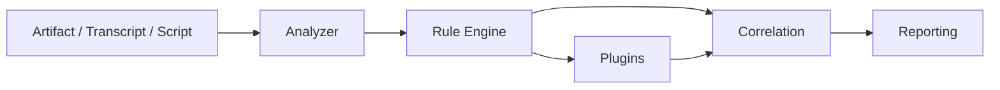

# ProtoAudit


ProtoAudit is a modular defensive framework for analyzing protocol behavior, cryptographic metadata, and randomness patterns. It combines transcript parsing, rule-driven findings, cross-analyzer correlation, and case-study driven examples in one research-friendly toolkit.

It is built for inspection and validation, not for stealthy scanning or offensive automation.

## Why this repository exists

Protocol failures often do not look dramatic. A handshake may appear to work while quietly reusing challenge material, repeating proofs, leaking deterministic randomness, or looping through retry states without establishing fresh session context.

ProtoAudit is meant to make those patterns visible.

## What ProtoAudit can do

- Inspect raw transcripts and structured protocol scripts
- Track message states and infer coarse protocol phases
- Detect challenge / proof reuse and retry-loop patterns
- Analyze crypto-related metadata for missing safeguards
- Analyze randomness-like artifacts for repetition and leakage signals
- Correlate findings across analyzers
- Render results to console, JSON, Markdown, and HTML
- Extend the pipeline through runtime plugins

## Scope and Limitations

ProtoAudit focuses on behavioral analysis of protocol transcripts rather than packet-level inspection.

It is designed to surface structural patterns and anomalies in protocol interactions, including:

- challenge reuse across protocol phases
- repeated proof or response artifacts
- deterministic randomness patterns
- retry-loop protocol states
- incomplete or inconsistent handshake flows

ProtoAudit is **not intended to replace packet inspection tools** such as network analyzers.

Instead, it complements traditional tools by focusing on protocol behavior and cryptographic metadata patterns that may not be immediately visible in packet captures.

Typical workflow:

1. Capture traffic using a network analyzer
2. Extract protocol transcripts or message flows
3. Run ProtoAudit to identify behavioral patterns or anomalies

This design keeps the framework lightweight and focused on protocol research and analysis.

## Architecture at a glance

ProtoAudit is built as a modular analysis framework.

Core components:

  * Analyzer modules - Individual analyzers inspect protocol transcripts for specific patterns (protocol behavior, cryptographic metadata, randomness anomalies).

  * Rule engine - Findings are generated using rule-driven pattern detection.

  * Plugin system - Additional analyzers can be loaded dynamically.

  * Reporting layer - Results can be exported in multiple formats:
      - console,
      - JSON,
      - Markdown,
      - and HTML.

This modular design allows researchers to extend ProtoAudit with new protocol analysis techniques.



Repository layout:

```text
src/protoaudit/
  core/        shared models, engine, config, I/O, rules, correlation
  analyzers/   protocol, crypto, randomness analyzers
  toolkit/     transcript parsing, replay, fuzzing, extraction helpers
  rules/       normalized Python rules
  plugins/     optional extension points with runtime loading
  reporting/   console, JSON, Markdown, HTML renderers
```

## Recommended first reads

- `docs/QUICKSTART.md`
- `docs/ARCHITECTURE.md`
- `docs/ANALYZERS.md`
- `docs/CONFIGURATION.md`
- `docs/CASE_STUDIES.md`
- `docs/PLUGINS.md`

## Fastest way to try it

```bash
python -m venv .venv
source .venv/bin/activate
pip install -e .[dev]
pytest
protoaudit analyze protocol examples/protocol/retry_loop_case_study/session.txt --profile strict
```

## Try this first

If you want a quick overview of what ProtoAudit detects, start with one of the included protocol case studies.

Example:

```bash
protoaudit analyze protocol examples/protocol/retry_loop_case_study/session.txt --format markdown
```

This example demonstrates a retry-loop handshake pattern where challenge and response material repeat across protocol phases.

ProtoAudit will detect patterns such as:

- repeated challenge-like values
- repeated proof or response artifacts
- incomplete handshake flows
- retry-loop protocol states

To explore other scenarios:

```bash
protoaudit analyze protocol examples/protocol/cached_handshake_material_case_study/session.txt
```

or

```bash
protoaudit analyze protocol examples/protocol/structured_pairing_retry_case_study/pairing_script.json
```

These case studies simulate realistic protocol failure modes that ProtoAudit is designed to surface during protocol research and analysis.

## Example output

```text
Analyzer: protocol
Messages observed: 9
Handshake detected: yes
Handshake complete: no
Repeated challenge-like values: yes
Repeated response values: yes

Findings:
- Challenge-like field observed
- Repeated protocol responses detected
- Challenge-like values repeat across messages
- Handshake-like flow appears incomplete
- Repeated protocol phase loop observed
```

## Commands

```bash
protoaudit analyze protocol <input>
protoaudit analyze crypto <input>
protoaudit analyze randomness <input>
protoaudit correlate <result.json> [more_result.json ...]
protoaudit transcript parse <input>
protoaudit replay build <input>
protoaudit fuzz generate <input>
protoaudit extract blocks <input>
protoaudit extract json <input>
protoaudit plugins list
```

## Protocol case studies

ProtoAudit is designed for protocol behavior analysis in research and investigation scenarios.

Typical use cases include:

  * Protocol research
      Researchers analyzing custom or undocumented protocols can use ProtoAudit to detect structural patterns such as challenge reuse, retry loops, and deterministic randomness.

  * Security investigations
      Security analysts can inspect protocol transcripts for signs of implementation mistakes or unsafe cryptographic behavior.

  * CTF protocol challenges
      Many CTF challenges include proprietary protocol implementations.  
      ProtoAudit can help surface structural weaknesses or repeated artifacts within protocol interactions.

  * Implementation testing
      Developers working on protocol implementations can use ProtoAudit to validate that randomness, challenge generation, and handshake flows behave as expected.

ProtoAudit ships with three realistic protocol mini case studies under `examples/protocol/`.

| Case study | Input type | What it demonstrates |
|---|---|---|
| `retry_loop_case_study/` | timestamped transcript | incomplete handshake, repeated challenge/proof, retry loop |
| `cached_handshake_material_case_study/` | timestamped transcript | successful-looking handshake with reused session material |
| `structured_pairing_retry_case_study/` | structured JSON script | repeated pairing artifacts on harness-style input |

Recommended starting point:

```bash
protoaudit analyze protocol examples/protocol/retry_loop_case_study/session.txt --format markdown
```

## Configuration and plugins

Use a stricter analysis profile:

```bash
protoaudit --config examples/config.strict.json analyze protocol examples/transcripts/sample_transcript.txt
```

List available runtime plugins:

```bash
protoaudit plugins list
```

Run analysis with plugin enrichment enabled:

```bash
protoaudit --config examples/config.plugins.json analyze protocol examples/protocol/retry_loop_case_study/session.txt --format json
```

## Current project status

ProtoAudit is already usable as a research-grade protocol analysis project. The repository currently includes:

- shared domain model and execution pipeline
- protocol / crypto / randomness analyzers
- protocol phase inference, state tracking, and handshake detection
- normalized Python rules with config-aware thresholds
- deeper artifact I/O and config loading
- transcript, replay, fuzzing, and extraction helpers
- runtime plugin loading and built-in enrichment plugins
- realistic protocol case studies and regression tests

## License

MIT
